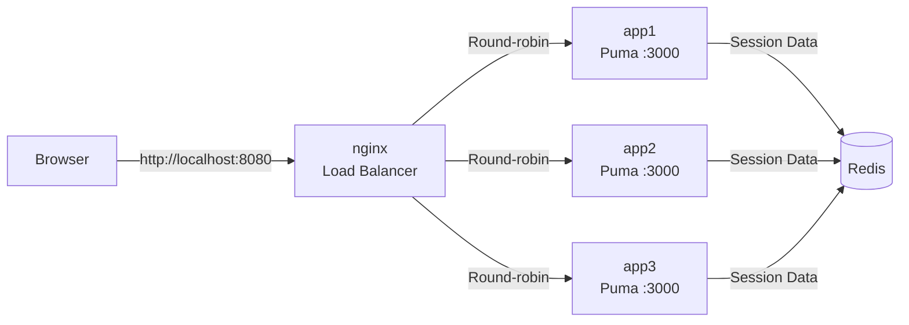

# Split Rails Example 2

A simple Rails application to demonstrate the Split gem for A/B testing.

## Overview

This application provides a single demo page that showcases three A/B test experiments:

1. **Background Color**: white, lightblue, or lightgreen
2. **Heading Font**: serif, sans-serif, or monospace
3. **Layout Style**: centered, left, or right alignment

## Features

- Simple, single-view demo application
- 3 visual A/B test experiments that are immediately visible
- Split Dashboard integration for viewing experiment results
- Goal tracking when users click the demo button

## Requirements

- Docker & Docker Compose (recommended)
- Or: Ruby 3.3+, Rails 8.1+, Redis

## Architecture

### Docker Compose Setup



This setup simulates a production-like environment with multiple independent Puma instances behind an nginx load balancer.

## Setup

### Option 1: Docker Compose (Recommended)

1. Start the application:
```bash
docker-compose up --build
```

2. Visit the application:
- Demo page: http://localhost:8080
- Split Dashboard: http://localhost:8080/split
  - Username: `admin`
  - Password: `secret`

3. View logs from all instances:
```bash
docker-compose logs -f app1 app2 app3
```

You'll see requests being distributed across three Puma instances (app1, app2, app3), which helps reproduce issues with Split's multi-server deployment.

4. Stop the application:
```bash
docker-compose down
```

### Option 2: Local Development

1. Install dependencies:
```bash
bundle install
```

2. Start Redis:
```bash
redis-server
```

3. Start the Rails server:
```bash
bin/rails server
```

4. Visit the application:
- Demo page: http://localhost:3000
- Split Dashboard: http://localhost:3000/split
  - Username: `admin`
  - Password: `secret`

## A/B Test Experiments

### Background Color
- **Alternatives**: white, lightblue, lightgreen
- **Goal**: button_clicked

### Heading Font
- **Alternatives**: serif, sans-serif, monospace
- **Goal**: button_clicked

### Layout Style
- **Alternatives**: centered, left, right
- **Goal**: button_clicked

## Usage

1. Open the demo page in different browsers or incognito windows to see different variations
2. Click the "Click Me to Track Goal!" button to track the goal
3. Visit the Split Dashboard to see experiment results and statistics

## Testing

### Testing A/B Experiments

1. Clear your browser cookies or use incognito mode
2. Refresh the page multiple times to see different variations
3. Click the goal button to record conversions
4. Check the Split Dashboard to see results

### Testing Load Balancing (Docker Compose)

To verify that requests are being distributed across multiple Puma instances:

```bash
# Send multiple requests and observe the distribution
for i in {1..20}; do
  curl -s http://localhost:8080 >/dev/null
  sleep 0.1
done

# Watch the logs to see different instances handling requests
docker-compose logs -f app1 app2 app3
```

You should see requests being handled by different instances (app1, app2, app3) in the logs.
